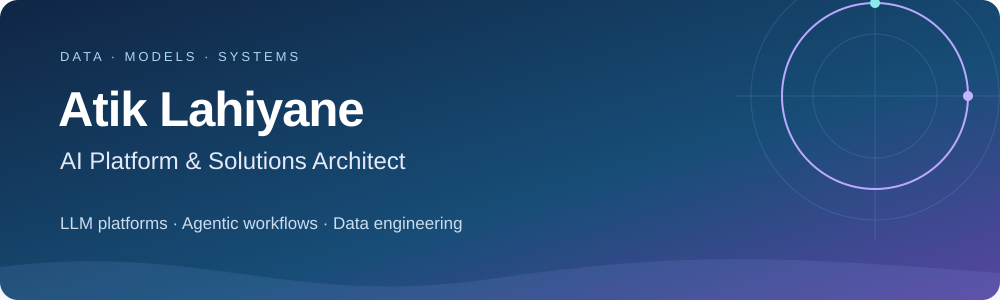

  

  <a href="https://atiklhy.fr/en/"><b>Portfolio</b></a> &nbsp;·&nbsp;
  <a href="https://atiklhy.fr/en/architecture/"><b>Architecture</b></a> &nbsp;·&nbsp;
  <a href="https://www.linkedin.com/in/atik-l-0454b0b9"><b>LinkedIn</b></a> &nbsp;·&nbsp;
  <a href="https://cal.com/binblok/30min"><b>Book a call</b></a> &nbsp;·&nbsp;
  <a href="mailto:contact@binblok.com"><b>Email</b></a>

## Enterprise AI & data architecture

I'm **Atik L.**, an **AI Platform & Solutions Architect** with **10+ years of enterprise delivery** across banking, insurance and energy.

I combine architecture, technical leadership and hands-on engineering to connect business needs with reliable data and AI systems. My focus today is **LLM platforms, inference and agentic workflows**, grounded in enterprise data and the demands of production.

## Professional track record

| Sector | Responsibility and delivery |
| :--- | :--- |
| **Banking & payments** | Data and ML engineering for payment processing, cross-border payment tracking, sanctions screening and fraud detection. |
| **Insurance & actuarial** | Technical leadership across data and AI engineering. Ownership of an IFRS 17 centralization engine, legacy processing modernization and shared data infrastructure. |
| **Energy & utilities** | Lead data engineering and data lake architecture for electricity consumption, forecasting and operational analytics. |
| **Procurement & B2B** | Lead AI and data engineering for a procurement platform across multiple countries, including LLM enrichment and retrieval over enterprise data. |

[Selected experience and case studies →](https://atiklhy.fr/en/portfolio/)

## Open-source engineering

### [Ondine](https://github.com/ptimizeroracle/ondine)

**An engine for enriching tabular data with LLMs.** Turn prompts into structured columns, with schema validation, checkpointing, budget limits and cost tracking.

[Repository](https://github.com/ptimizeroracle/ondine) · [Documentation](https://docs.ondine.dev/) · [PyPI](https://pypi.org/project/ondine/)

<b>Explore two public engineering demonstrations</b>

- [**Financial data engineering**](https://github.com/ptimizeroracle/financial-data-engineering-demo) — financial-message ingestion, feature engineering and anomaly scoring using synthetic transactions.
- [**Brand analytics platform**](https://github.com/ptimizeroracle/brand-performance-dashboard) — a reproducible pipeline connecting data normalization, dimensional modeling and an interactive dashboard.

These are standalone demonstrations. Client systems and proprietary code remain private.

## Technology stack

Selected technologies across enterprise delivery and independent engineering.

### LLM inference & model access

  
  
  
  

Azure OpenAI · Model routing · Embeddings & reranking

### Agentic systems & retrieval

  
  
  
  

Weaviate · Elasticsearch · Tool integration · Structured outputs

### Data platforms & distributed processing

  
  
  
  
  

Hive · HBase · MapR · Dremio · dbt · Polars

### Evaluation & observability

  
  
  
  

OpenTelemetry · RAGAS · Deequ · Production monitoring

### Cloud & platform engineering

  
  
  
  

Domino Data Lab · Linux · Azure DevOps · Git

### Languages

  
  
  
  

## Architecture & writing

I write about architecture decisions, production constraints and controlled experiments in LLM and agentic systems. Each case study identifies its scope and evidence.

- [**Interactive platform architecture**](https://atiklhy.fr/en/architecture/#architecture-map) — explore the layers and the review question behind each block.
- [**Engineering articles**](https://atiklhy.fr/en/articles/) — LLM platforms, agent execution, evaluation and operational controls.
- [**Selected case studies**](https://atiklhy.fr/en/portfolio/) — data and AI work, with its context and limitations.

---

  <b>Need architecture and engineering leadership for an enterprise AI platform?</b>  
  <a href="https://cal.com/binblok/30min">Let's discuss your project →</a>  
  Paris, France · English &amp; French

  

